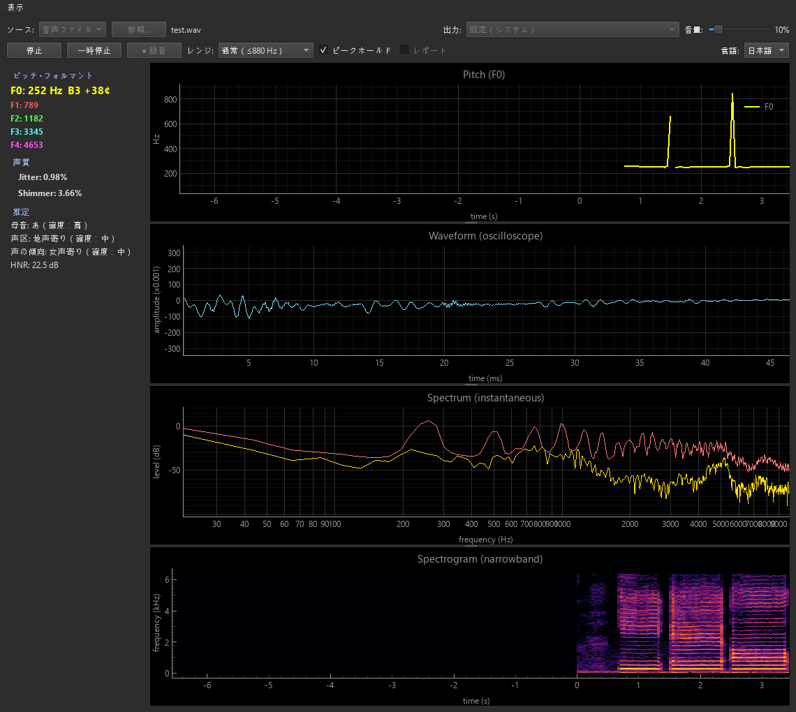

# XVALite

リアルタイム・ボイストレーニング支援ツール。マイクや音声ファイルから、声の
**ピッチ（F0）**・**フォルマント（F1〜F4）**・**声質（Jitter / Shimmer）** を
リアルタイムに可視化します。

> A real-time voice-training aid: live pitch, formant, and jitter/shimmer
> visualization from microphone or audio-file input.



## ダウンロード（配布版）

ビルド済みの実行ファイルを Google Drive で配布しています。**Python のインストールは不要**です（Windows 向け）。

📦 **[ダウンロード（Google Drive）](https://drive.google.com/drive/folders/1pettJwR26mmdZwlys07NzLINzFw2JFBS?usp=sharing)**

**使い方:**

1. 上記リンクからフォルダ（または zip）をダウンロードします。
2. zip の場合は展開し、`XVALite` フォルダを任意の場所に置きます。
3. フォルダ内の **`XVALite.exe`** をダブルクリックで起動します。
   - フォルダ版は `XVALite` フォルダごと必要です（中のファイルを単体で動かさないでください）。
   - 単一ファイル版（`XVALite.exe` 1個）の場合はそのまま実行できます。

> **「WindowsによってPCが保護されました」と表示されたら:**
> 本アプリはコード署名をしていないため、初回起動時に Windows SmartScreen の警告が出ることがあります。
> その場合は **「詳細情報」→「実行」** で起動できます（配布元が信頼できる場合のみ）。

ソースから動かしたい場合や、自分で `.exe` をビルドしたい場合は以下を参照してください。

## 機能

- **リアルタイムピッチ表示** — F0 を数値とスクロール式グラフで表示。無声・無音区間は線が途切れます。
- **F0 レンジ切替** — 通常（≤880 Hz / A5）と拡張（≤2100 Hz / C7）を実行中に切替。高音歌唱にも対応。
- **フォルマント表示** — F1〜F4 をスクロール式グラフ（約21 Hz 更新）と数値で表示。
- **声質モニタ** — Jitter / Shimmer を1秒ごとに算出し、閾値超過で警告表示。
- **入力ソース** — マイク入力／音声ファイル入力（同一パイプラインを実時間再生で解析）。
- **入力デッドゾーン** — 設定レベル未満の入力を無音として扱い、ノイズからの誤検出を抑制。
- **一時停止** — 解析・描画をまとめて停止／再開。
- **マウスオーバー** — グラフ上のカーソル位置の周波数（Hz）を表示。

## 動作環境

- Windows
- ソースから動かす場合: **Python 3.11**
  （Parselmouth / PySide6 が新しい Python の wheel を提供していないため 3.11 を使用）

## インストールと実行（ソースから）

```powershell
# リポジトリを取得
git clone https://github.com/FuyutsukiNatsuki/Xrosswave-Voice-Assistant-Lite.git
cd Xrosswave-Voice-Assistant-Lite

# 仮想環境を作成（Python 3.11）
py -3.11 -m venv .venv

# 依存をインストール
.\.venv\Scripts\python.exe -m pip install -r requirements.txt

# 起動（マイク入力）
.\.venv\Scripts\python.exe scripts\run_app.py

# 音声ファイルを指定して起動
.\.venv\Scripts\python.exe scripts\run_app.py --file path\to\audio.wav
```

主なオプション:

- `--file PATH` … 起動時に解析するファイルを指定（省略時はマイク）
- `--device N` … マイクのデバイス番号を指定
- `--silence-db DB` … 入力デッドゾーン（dBFS、既定 -40。0 に近づけるほど強くゲート）

## 使い方

1. **Source** でマイクか音声ファイルを選び（ファイルは **Browse…** で選択）、**Start**。
2. 上段にピッチ、下段にフォルマントの軌跡が左→右にスクロール表示されます。
3. **Range** で通常／拡張（C7）を切替。
4. **Pause** で解析・描画を一時停止、もう一度押すと再開。
5. 右上に F0・F1〜F4 の現在値、左に Jitter / Shimmer を表示（閾値超過時は赤く警告）。

## 単体実行ファイル（.exe）のビルド

Python が入っていない PC でも動く実行ファイルを作れます。

```powershell
.\.venv\Scripts\python.exe -m pip install -r requirements-dev.txt

# フォルダ版（推奨）→ dist\XVALite\XVALite.exe（XVALite フォルダごと配布）
powershell -ExecutionPolicy Bypass -File scripts\build_exe.ps1

# 単一ファイル版 → dist\XVALite.exe
powershell -ExecutionPolicy Bypass -File scripts\build_exe.ps1 -OneFile
```

> 実行可能な成果物は **`dist\`** にあります。`build\` は中間ファイル用で
> Python ランタイムを含まないため、そこから実行すると
> 「Failed to load Python DLL」エラーになります。

## アーキテクチャ概要

```
入力源 (AudioInput / FileInput)  ─ read() → 音声チャンク
        ▼
AnalysisPipeline（バックグラウンドスレッド・3カデンス）
   ├─ F0          … チャンク毎
   ├─ F1〜F4      … チャンク毎（約21 Hz）
   └─ Jitter/Shimmer … 1秒毎
        ▼
   結果ストリーム (drain) → GUI（PySide6 + pyqtgraph）
```

音声解析は [Parselmouth](https://github.com/YannickJadoul/Parselmouth)（Praat）を使用。
詳細な設計・コマンドは [`CLAUDE.md`](CLAUDE.md)、開発経緯は [`Handoff.md`](Handoff.md) を参照してください。

## ライセンス

本プロジェクトは **GNU General Public License v3.0 (GPLv3)** で公開されています。
全文は [`LICENSE`](LICENSE) を参照してください。

音声解析に用いている **Parselmouth（Praat）が GPLv3** のため、本プロジェクトも
GPLv3 としています。本ソフトウェアを利用・改変・再配布する場合は GPLv3 の条件に
従ってください。

## 使用しているオープンソース

| ライブラリ | 用途 | ライセンス |
|-----------|------|-----------|
| [Parselmouth](https://github.com/YannickJadoul/Parselmouth) / [Praat](https://www.praat.org/) | 音声解析（F0・フォルマント・Jitter/Shimmer） | GPLv3 |
| [PySide6](https://doc.qt.io/qtforpython/) | GUI | LGPLv3 |
| [pyqtgraph](https://www.pyqtgraph.org/) | リアルタイムグラフ | MIT |
| [NumPy](https://numpy.org/) | 数値計算 | BSD |
| [sounddevice](https://python-sounddevice.readthedocs.io/) | 音声入出力 | MIT |
| [soundfile](https://python-soundfile.readthedocs.io/) | 音声ファイル読み込み | BSD |
